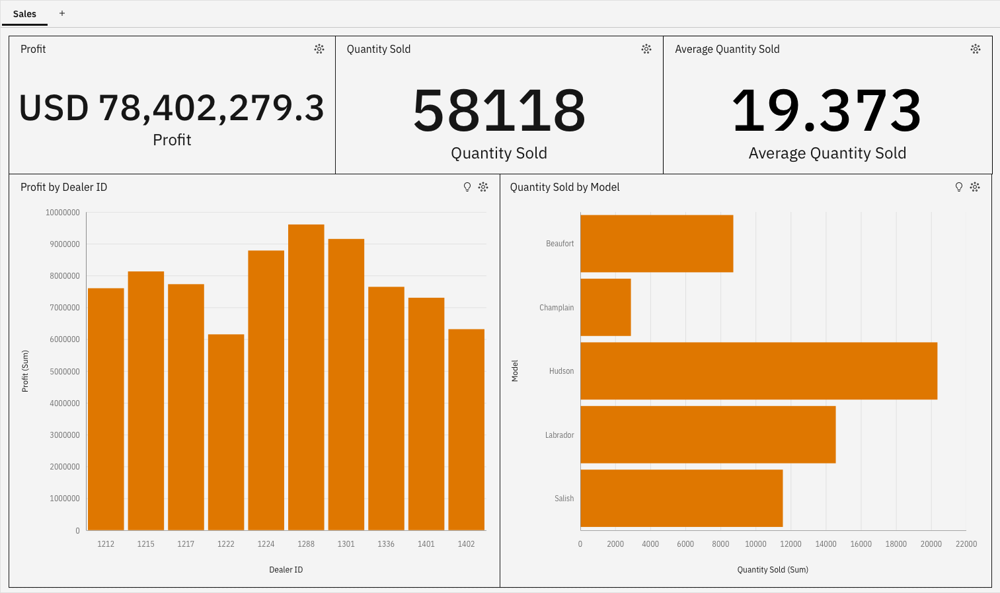
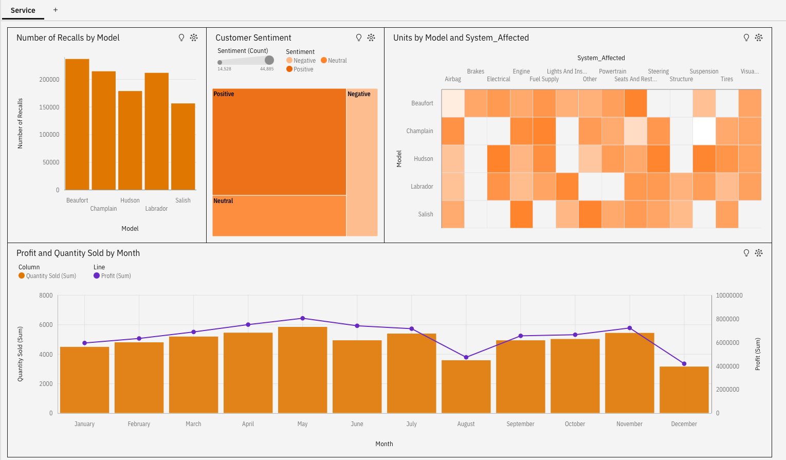

# Automotive Sales Service Dashboard
Interactive business intelligence dashboard built in IBM Cognos Analytics to analyse vehicle sales performance, dealer profitability, product demand, service issues, and customer sentiment.

## Tools
IBM Cognos Analytics

## What I analysed
- Total sales profit and overall vehicle demand
- Profit performance across different dealers
- Quantity sold by vehicle model
- Monthly trends in profit and quantity sold
- Vehicle recalls by model
- Customer sentiment distribution
- Systems affected in vehicle service issues

## Key insights
- Total profit reached approximately **USD 78.4M** with **58,118 vehicles sold**.
- Dealer **1288** generated the highest profit, while some dealers contributed significantly less, indicating uneven dealer performance.
- The **Hudson model** had the highest sales volume, followed by **Labrador and Salish**, while **Champlain** showed the lowest demand.
- Sales and profit trends peak around **May and November**, with a noticeable drop in **August**, suggesting possible seasonal demand patterns.
- The **Beaufort model** experienced the highest number of recalls, indicating potential reliability concerns.
- Customer sentiment is largely **positive**, but a significant share of **neutral and negative feedback** highlights areas for service improvement.
- Service issues frequently involve **engine, electrical, and suspension systems**, suggesting common technical problem areas.

## Example Visualisations

### Sales Dashboard

### Service Dashboard

## Outcome
The dashboard provides a combined view of **sales performance and service quality**, helping identify high-performing dealers, best-selling vehicle models, seasonal sales patterns, and recurring service issues.  
These insights can support **better sales strategy, product improvements, and customer experience management**.
